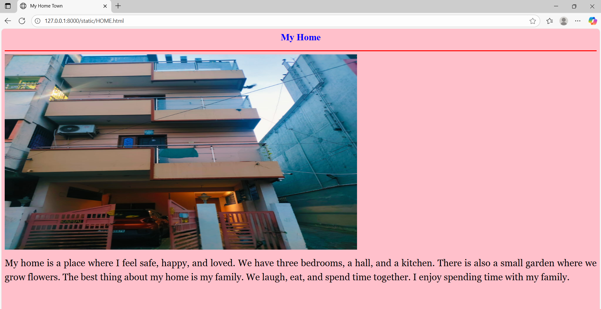

# Ex04 Places Around Me
## NAME-SRILAKSHMI.B.H
## REG.NO-212224100057
## AIM
To develop a website to display details about the places around my house.

## DESIGN STEPS

### STEP 1
Create a Django admin interface.

### STEP 2
Download your city map from Google.

### STEP 3
Using ```<map>``` tag name the map.

### STEP 4
Create clickable regions in the image using ```<area>``` tag.

### STEP 5
Write HTML programs for all the regions identified.

### STEP 6
Execute the programs and publish them.

## CODE

MAP.HTML
```
<html>
<head>
    <title>My City</title>
</head>
<body> 
    <h1 align="center"><font color="Red"><b>Redhills</b></font></h1>
    <h3 align="center"><font color="blue"><b>Srilakshmi.B.H (212224100057)</b></font></h3>
    <center>
        
        <map name="My Home Town">
            <area target="_blank" alt="SKLS GALAXY MALL" title="SKLS GALAXY MALL" href="MALL.html" coords="1705,209,1743,234" shape="rect">
            <area target="_blank" alt="Sri Nallalaghu Nadar Polytechnic College" title="Sri Nallalaghu Nadar Polytechnic College" href="COLLEGE.html" coords="825,631,870,676" shape="rect">
            <area target="_blank" alt="REVATHI STORES The Best Shop - REDHILLS" title="REVATHI STORES The Best Shop - REDHILLS" href="STORE.html" coords="172,407,219,449" shape="rect">
            <area target="_blank" alt="My Home" title="My Home" href="HOME.html" coords="1326,433,1359,474" shape="rect">
            <area target="_blank" alt="Puzhal Lake" title="Puzhal Lake" href="LAKE.html" coords="1033,4,227,4,221,73,334,93,415,137,520,173,618,195,723,208,821,230,926,220,1011,103" shape="poly">
        </map>
    </center>
</body>
</html>
```
HOME.HTML
```
<html>
    <head>
        <title>My Home Town</title>
    </head>
    <body bgcolor="pink">
        <h2 align="center">
            <font color="blue"><b>My Home</b></font>
        </h2>
        <hr size="3" color="red">
        
        <p align="justify" style="line-height: 1.5;">
            <font face="Georgia" size="5">
                My home is a place where I feel safe, happy, and loved. We have three bedrooms, a hall, and a kitchen. There is also a small garden where we grow flowers.

The best thing about my home is my family. We laugh, eat, and spend time together. I enjoy spending time with my family.
            </font>
        </p>
    </body>
</html>
```
STORE.HTML
```
<html>
    <head>
        <title>My Home Town</title>
    </head>
    <body bgcolor="pink">
        <h2 align="center">
            <font color="blue"><b>REVATHI STORES The Best Shop - REDHILLS</b></font>
        </h2>
        <hr size="3" color="red">
        
        <p align="justify" style="line-height: 1.5;">
            <font face="Georgia" size="5">Revathi Stores are a chain of various stores in Chennai, offering a wide range of products from clothing and sarees to groceries and furniture. Known for their affordability and extensive product selection, these stores have been a part of the community for decades, with a focus on customer satisfaction and a comprehensive shopping experience. </p>
    </body>
</html>
```
LAKE.HTML
```
<html>
    <head>
        <title>My Home Town</title>
    </head>
    <body bgcolor="pink">
        <h2 align="center">
            <font color="blue"><b>Puzhal Lake</b></font>
        </h2>
        <hr size="3" color="red">
        
        <p align="justify" style="line-height: 1.5;">
            <font face="Georgia" size="5">
               Puzhal Lake, also known as Red Hills Lake, is a rain-fed reservoir near Chennai that serves as a major water source for the city. Constructed in the 19th century by the British, it is a popular spot for nature lovers, offering a serene environment for sunrise and sunset views. The lake's full capacity is 3,300 million cubic feet and it includes a historical tower, Jone Tower, built in 1881 to measure water levels.  
</p>
    </body>
</html>
```
COLLEGE.HTML
```
<html>
    <head>
        <title>
            My Home Town
        </title>
    </head>
    <body bgcolor="pink">
        <h2 align="center">
            <font color="blue"><b>Sri Nallalaghu Nadar Polytechnic College</b></font>
        </h2>
        <hr size="3" color="red">
        
        <p align="justify" style="line-height: 1.5;">
            <font face="Georgia" size="5">Sri Nallalaghu Nadar Polytechnic College is a private, AICTE-approved college in Puzhal, Chennai, established in 1983. It offers diploma courses in various engineering fields, including mechanical, civil, and computer engineering, and focuses on providing quality technical education with a strong emphasis on practical training and student development. The college has a 41-acre campus with facilities like a library, hostel, and sports grounds.  </p>
    </body>
</html>
```
MALL.HTML
```
<html>
    <head>
        <title>My Home Town</title>
    </head>
    <body bgcolor="pink">
        <h2 align="center">
            <font color="blue"><b>SKLS GALAXY MALL</b></font>
        </h2>
        <hr size="3" color="red">
        
        <p align="justify" style="line-height: 1.5;">
            <font face="Georgia" size="5">SKLS GALAXY MALL PRIVATE LIMITED is a Private company incorporated on 16 Dec 2016. It is classified as Non-government company.</p>
    </body>
</html>
```


## OUTPUT





## RESULT
The program for implementing image maps using HTML is executed successfully.
